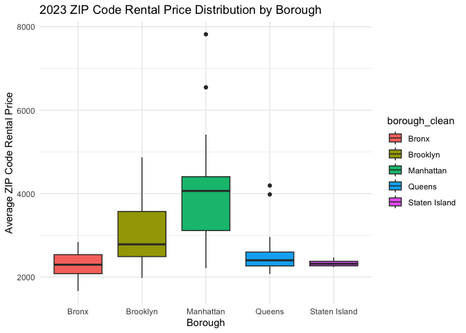

P8105 Homework 3
================
Spencer Riddell

# Homework 3

------------------------------------------------------------------------

## Problem 1

### 1. Instacart data description

``` r
library(p8105.datasets)
data("instacart")
glimpse(instacart)
```

    ## Rows: 1,384,617
    ## Columns: 15
    ## $ order_id               <int> 1, 1, 1, 1, 1, 1, 1, 1, 36, 36, 36, 36, 36, 36,…
    ## $ product_id             <int> 49302, 11109, 10246, 49683, 43633, 13176, 47209…
    ## $ add_to_cart_order      <int> 1, 2, 3, 4, 5, 6, 7, 8, 1, 2, 3, 4, 5, 6, 7, 8,…
    ## $ reordered              <int> 1, 1, 0, 0, 1, 0, 0, 1, 0, 1, 0, 1, 1, 1, 1, 1,…
    ## $ user_id                <int> 112108, 112108, 112108, 112108, 112108, 112108,…
    ## $ eval_set               <chr> "train", "train", "train", "train", "train", "t…
    ## $ order_number           <int> 4, 4, 4, 4, 4, 4, 4, 4, 23, 23, 23, 23, 23, 23,…
    ## $ order_dow              <int> 4, 4, 4, 4, 4, 4, 4, 4, 6, 6, 6, 6, 6, 6, 6, 6,…
    ## $ order_hour_of_day      <int> 10, 10, 10, 10, 10, 10, 10, 10, 18, 18, 18, 18,…
    ## $ days_since_prior_order <int> 9, 9, 9, 9, 9, 9, 9, 9, 30, 30, 30, 30, 30, 30,…
    ## $ product_name           <chr> "Bulgarian Yogurt", "Organic 4% Milk Fat Whole …
    ## $ aisle_id               <int> 120, 108, 83, 83, 95, 24, 24, 21, 2, 115, 53, 1…
    ## $ department_id          <int> 16, 16, 4, 4, 15, 4, 4, 16, 16, 7, 16, 4, 16, 2…
    ## $ aisle                  <chr> "yogurt", "other creams cheeses", "fresh vegeta…
    ## $ department             <chr> "dairy eggs", "dairy eggs", "produce", "produce…

``` r
summary(instacart)
```

    ##     order_id         product_id    add_to_cart_order   reordered     
    ##  Min.   :      1   Min.   :    1   Min.   : 1.000    Min.   :0.0000  
    ##  1st Qu.: 843370   1st Qu.:13380   1st Qu.: 3.000    1st Qu.:0.0000  
    ##  Median :1701880   Median :25298   Median : 7.000    Median :1.0000  
    ##  Mean   :1706298   Mean   :25556   Mean   : 8.758    Mean   :0.5986  
    ##  3rd Qu.:2568023   3rd Qu.:37940   3rd Qu.:12.000    3rd Qu.:1.0000  
    ##  Max.   :3421070   Max.   :49688   Max.   :80.000    Max.   :1.0000  
    ##     user_id         eval_set          order_number      order_dow    
    ##  Min.   :     1   Length:1384617     Min.   :  4.00   Min.   :0.000  
    ##  1st Qu.: 51732   Class :character   1st Qu.:  6.00   1st Qu.:1.000  
    ##  Median :102933   Mode  :character   Median : 11.00   Median :3.000  
    ##  Mean   :103113                      Mean   : 17.09   Mean   :2.701  
    ##  3rd Qu.:154959                      3rd Qu.: 21.00   3rd Qu.:5.000  
    ##  Max.   :206209                      Max.   :100.00   Max.   :6.000  
    ##  order_hour_of_day days_since_prior_order product_name          aisle_id    
    ##  Min.   : 0.00     Min.   : 0.00          Length:1384617     Min.   :  1.0  
    ##  1st Qu.:10.00     1st Qu.: 7.00          Class :character   1st Qu.: 31.0  
    ##  Median :14.00     Median :15.00          Mode  :character   Median : 83.0  
    ##  Mean   :13.58     Mean   :17.07                             Mean   : 71.3  
    ##  3rd Qu.:17.00     3rd Qu.:30.00                             3rd Qu.:107.0  
    ##  Max.   :23.00     Max.   :30.00                             Max.   :134.0  
    ##  department_id      aisle            department       
    ##  Min.   : 1.00   Length:1384617     Length:1384617    
    ##  1st Qu.: 4.00   Class :character   Class :character  
    ##  Median : 8.00   Mode  :character   Mode  :character  
    ##  Mean   : 9.84                                        
    ##  3rd Qu.:16.00                                        
    ##  Max.   :21.00

``` r
head(instacart)
```

    ## # A tibble: 6 × 15
    ##   order_id product_id add_to_cart_order reordered user_id eval_set order_number
    ##      <int>      <int>             <int>     <int>   <int> <chr>           <int>
    ## 1        1      49302                 1         1  112108 train               4
    ## 2        1      11109                 2         1  112108 train               4
    ## 3        1      10246                 3         0  112108 train               4
    ## 4        1      49683                 4         0  112108 train               4
    ## 5        1      43633                 5         1  112108 train               4
    ## 6        1      13176                 6         0  112108 train               4
    ## # ℹ 8 more variables: order_dow <int>, order_hour_of_day <int>,
    ## #   days_since_prior_order <int>, product_name <chr>, aisle_id <int>,
    ## #   department_id <int>, aisle <chr>, department <chr>

The Instacart dataset contains 1,384,617 rows and 15 columns,
representing individual items ordered from Instacart. Key variables
include order_id (the unique identifier for each order), product_id and
product_name (identifying products), aisle and department (categorizing
products), and ordering context such as order_hour_of_day and order_dow
(day of week). Most orders are placed in the afternoon, with a median
order hour of 14. Many products are reordered, and the most common
aisles are “fresh vegetables” and “fresh fruits”.

------------------------------------------------------------------------

### 2. How many aisles are there, and which aisles are the most items ordered from?

``` r
aisle_counts <- instacart %>%
  count(aisle, sort = TRUE)

n_aisles <- n_distinct(instacart$aisle)
aisle_counts
```

    ## # A tibble: 134 × 2
    ##    aisle                              n
    ##    <chr>                          <int>
    ##  1 fresh vegetables              150609
    ##  2 fresh fruits                  150473
    ##  3 packaged vegetables fruits     78493
    ##  4 yogurt                         55240
    ##  5 packaged cheese                41699
    ##  6 water seltzer sparkling water  36617
    ##  7 milk                           32644
    ##  8 chips pretzels                 31269
    ##  9 soy lactosefree                26240
    ## 10 bread                          23635
    ## # ℹ 124 more rows

``` r
n_aisles
```

    ## [1] 134

There are 134 distinct aisles in the dataset. The most frequently
ordered aisles are “fresh vegetables” (150,609 items) and “fresh fruits”
(150,473 items), indicating a high volume of produce purchases.

------------------------------------------------------------------------

### 3. Plot: Number of items ordered in each aisle (\>10,000 items)

``` r
aisle_counts %>%
  filter(n > 10000) %>%
  mutate(aisle = fct_reorder(aisle, n)) %>%
  ggplot(aes(x = aisle, y = n)) +
  geom_col() +
  coord_flip() +
  labs(
    title = "Items ordered by aisle (more than 10,000 items)",
    x = "Aisle",
    y = "Number of items ordered"
  )
```

<!-- -->

The plot shows that a small subset of aisles accounts for the majority
of ordered items. “Fresh vegetables,” “fresh fruits,” and “packaged
vegetables fruits” dominate, with a sharp drop-off after the top aisles.
This suggests consumer purchases are concentrated in a few aisles,
likely reflecting staple grocery needs.

------------------------------------------------------------------------

### 4. Table: Three most popular items in selected aisles

``` r
selected_aisles <- c("baking ingredients", "dog food care", "packaged vegetables fruits")

instacart %>%
  filter(aisle %in% selected_aisles) %>%
  count(aisle, product_name, sort = TRUE) %>%
  group_by(aisle) %>%
  slice_max(order_by = n, n = 3) %>%
  ungroup() %>%
  arrange(aisle, desc(n)) %>%
  gt()
```

<div id="uecmihmfnc" style="padding-left:0px;padding-right:0px;padding-top:10px;padding-bottom:10px;overflow-x:auto;overflow-y:auto;width:auto;height:auto;">
<style>#uecmihmfnc table {
  font-family: system-ui, 'Segoe UI', Roboto, Helvetica, Arial, sans-serif, 'Apple Color Emoji', 'Segoe UI Emoji', 'Segoe UI Symbol', 'Noto Color Emoji';
  -webkit-font-smoothing: antialiased;
  -moz-osx-font-smoothing: grayscale;
}
&#10;#uecmihmfnc thead, #uecmihmfnc tbody, #uecmihmfnc tfoot, #uecmihmfnc tr, #uecmihmfnc td, #uecmihmfnc th {
  border-style: none;
}
&#10;#uecmihmfnc p {
  margin: 0;
  padding: 0;
}
&#10;#uecmihmfnc .gt_table {
  display: table;
  border-collapse: collapse;
  line-height: normal;
  margin-left: auto;
  margin-right: auto;
  color: #333333;
  font-size: 16px;
  font-weight: normal;
  font-style: normal;
  background-color: #FFFFFF;
  width: auto;
  border-top-style: solid;
  border-top-width: 2px;
  border-top-color: #A8A8A8;
  border-right-style: none;
  border-right-width: 2px;
  border-right-color: #D3D3D3;
  border-bottom-style: solid;
  border-bottom-width: 2px;
  border-bottom-color: #A8A8A8;
  border-left-style: none;
  border-left-width: 2px;
  border-left-color: #D3D3D3;
}
&#10;#uecmihmfnc .gt_caption {
  padding-top: 4px;
  padding-bottom: 4px;
}
&#10;#uecmihmfnc .gt_title {
  color: #333333;
  font-size: 125%;
  font-weight: initial;
  padding-top: 4px;
  padding-bottom: 4px;
  padding-left: 5px;
  padding-right: 5px;
  border-bottom-color: #FFFFFF;
  border-bottom-width: 0;
}
&#10;#uecmihmfnc .gt_subtitle {
  color: #333333;
  font-size: 85%;
  font-weight: initial;
  padding-top: 3px;
  padding-bottom: 5px;
  padding-left: 5px;
  padding-right: 5px;
  border-top-color: #FFFFFF;
  border-top-width: 0;
}
&#10;#uecmihmfnc .gt_heading {
  background-color: #FFFFFF;
  text-align: center;
  border-bottom-color: #FFFFFF;
  border-left-style: none;
  border-left-width: 1px;
  border-left-color: #D3D3D3;
  border-right-style: none;
  border-right-width: 1px;
  border-right-color: #D3D3D3;
}
&#10;#uecmihmfnc .gt_bottom_border {
  border-bottom-style: solid;
  border-bottom-width: 2px;
  border-bottom-color: #D3D3D3;
}
&#10;#uecmihmfnc .gt_col_headings {
  border-top-style: solid;
  border-top-width: 2px;
  border-top-color: #D3D3D3;
  border-bottom-style: solid;
  border-bottom-width: 2px;
  border-bottom-color: #D3D3D3;
  border-left-style: none;
  border-left-width: 1px;
  border-left-color: #D3D3D3;
  border-right-style: none;
  border-right-width: 1px;
  border-right-color: #D3D3D3;
}
&#10;#uecmihmfnc .gt_col_heading {
  color: #333333;
  background-color: #FFFFFF;
  font-size: 100%;
  font-weight: normal;
  text-transform: inherit;
  border-left-style: none;
  border-left-width: 1px;
  border-left-color: #D3D3D3;
  border-right-style: none;
  border-right-width: 1px;
  border-right-color: #D3D3D3;
  vertical-align: bottom;
  padding-top: 5px;
  padding-bottom: 6px;
  padding-left: 5px;
  padding-right: 5px;
  overflow-x: hidden;
}
&#10;#uecmihmfnc .gt_column_spanner_outer {
  color: #333333;
  background-color: #FFFFFF;
  font-size: 100%;
  font-weight: normal;
  text-transform: inherit;
  padding-top: 0;
  padding-bottom: 0;
  padding-left: 4px;
  padding-right: 4px;
}
&#10;#uecmihmfnc .gt_column_spanner_outer:first-child {
  padding-left: 0;
}
&#10;#uecmihmfnc .gt_column_spanner_outer:last-child {
  padding-right: 0;
}
&#10;#uecmihmfnc .gt_column_spanner {
  border-bottom-style: solid;
  border-bottom-width: 2px;
  border-bottom-color: #D3D3D3;
  vertical-align: bottom;
  padding-top: 5px;
  padding-bottom: 5px;
  overflow-x: hidden;
  display: inline-block;
  width: 100%;
}
&#10;#uecmihmfnc .gt_spanner_row {
  border-bottom-style: hidden;
}
&#10;#uecmihmfnc .gt_group_heading {
  padding-top: 8px;
  padding-bottom: 8px;
  padding-left: 5px;
  padding-right: 5px;
  color: #333333;
  background-color: #FFFFFF;
  font-size: 100%;
  font-weight: initial;
  text-transform: inherit;
  border-top-style: solid;
  border-top-width: 2px;
  border-top-color: #D3D3D3;
  border-bottom-style: solid;
  border-bottom-width: 2px;
  border-bottom-color: #D3D3D3;
  border-left-style: none;
  border-left-width: 1px;
  border-left-color: #D3D3D3;
  border-right-style: none;
  border-right-width: 1px;
  border-right-color: #D3D3D3;
  vertical-align: middle;
  text-align: left;
}
&#10;#uecmihmfnc .gt_empty_group_heading {
  padding: 0.5px;
  color: #333333;
  background-color: #FFFFFF;
  font-size: 100%;
  font-weight: initial;
  border-top-style: solid;
  border-top-width: 2px;
  border-top-color: #D3D3D3;
  border-bottom-style: solid;
  border-bottom-width: 2px;
  border-bottom-color: #D3D3D3;
  vertical-align: middle;
}
&#10;#uecmihmfnc .gt_from_md > :first-child {
  margin-top: 0;
}
&#10;#uecmihmfnc .gt_from_md > :last-child {
  margin-bottom: 0;
}
&#10;#uecmihmfnc .gt_row {
  padding-top: 8px;
  padding-bottom: 8px;
  padding-left: 5px;
  padding-right: 5px;
  margin: 10px;
  border-top-style: solid;
  border-top-width: 1px;
  border-top-color: #D3D3D3;
  border-left-style: none;
  border-left-width: 1px;
  border-left-color: #D3D3D3;
  border-right-style: none;
  border-right-width: 1px;
  border-right-color: #D3D3D3;
  vertical-align: middle;
  overflow-x: hidden;
}
&#10;#uecmihmfnc .gt_stub {
  color: #333333;
  background-color: #FFFFFF;
  font-size: 100%;
  font-weight: initial;
  text-transform: inherit;
  border-right-style: solid;
  border-right-width: 2px;
  border-right-color: #D3D3D3;
  padding-left: 5px;
  padding-right: 5px;
}
&#10;#uecmihmfnc .gt_stub_row_group {
  color: #333333;
  background-color: #FFFFFF;
  font-size: 100%;
  font-weight: initial;
  text-transform: inherit;
  border-right-style: solid;
  border-right-width: 2px;
  border-right-color: #D3D3D3;
  padding-left: 5px;
  padding-right: 5px;
  vertical-align: top;
}
&#10;#uecmihmfnc .gt_row_group_first td {
  border-top-width: 2px;
}
&#10;#uecmihmfnc .gt_row_group_first th {
  border-top-width: 2px;
}
&#10;#uecmihmfnc .gt_summary_row {
  color: #333333;
  background-color: #FFFFFF;
  text-transform: inherit;
  padding-top: 8px;
  padding-bottom: 8px;
  padding-left: 5px;
  padding-right: 5px;
}
&#10;#uecmihmfnc .gt_first_summary_row {
  border-top-style: solid;
  border-top-color: #D3D3D3;
}
&#10;#uecmihmfnc .gt_first_summary_row.thick {
  border-top-width: 2px;
}
&#10;#uecmihmfnc .gt_last_summary_row {
  padding-top: 8px;
  padding-bottom: 8px;
  padding-left: 5px;
  padding-right: 5px;
  border-bottom-style: solid;
  border-bottom-width: 2px;
  border-bottom-color: #D3D3D3;
}
&#10;#uecmihmfnc .gt_grand_summary_row {
  color: #333333;
  background-color: #FFFFFF;
  text-transform: inherit;
  padding-top: 8px;
  padding-bottom: 8px;
  padding-left: 5px;
  padding-right: 5px;
}
&#10;#uecmihmfnc .gt_first_grand_summary_row {
  padding-top: 8px;
  padding-bottom: 8px;
  padding-left: 5px;
  padding-right: 5px;
  border-top-style: double;
  border-top-width: 6px;
  border-top-color: #D3D3D3;
}
&#10;#uecmihmfnc .gt_last_grand_summary_row_top {
  padding-top: 8px;
  padding-bottom: 8px;
  padding-left: 5px;
  padding-right: 5px;
  border-bottom-style: double;
  border-bottom-width: 6px;
  border-bottom-color: #D3D3D3;
}
&#10;#uecmihmfnc .gt_striped {
  background-color: rgba(128, 128, 128, 0.05);
}
&#10;#uecmihmfnc .gt_table_body {
  border-top-style: solid;
  border-top-width: 2px;
  border-top-color: #D3D3D3;
  border-bottom-style: solid;
  border-bottom-width: 2px;
  border-bottom-color: #D3D3D3;
}
&#10;#uecmihmfnc .gt_footnotes {
  color: #333333;
  background-color: #FFFFFF;
  border-bottom-style: none;
  border-bottom-width: 2px;
  border-bottom-color: #D3D3D3;
  border-left-style: none;
  border-left-width: 2px;
  border-left-color: #D3D3D3;
  border-right-style: none;
  border-right-width: 2px;
  border-right-color: #D3D3D3;
}
&#10;#uecmihmfnc .gt_footnote {
  margin: 0px;
  font-size: 90%;
  padding-top: 4px;
  padding-bottom: 4px;
  padding-left: 5px;
  padding-right: 5px;
}
&#10;#uecmihmfnc .gt_sourcenotes {
  color: #333333;
  background-color: #FFFFFF;
  border-bottom-style: none;
  border-bottom-width: 2px;
  border-bottom-color: #D3D3D3;
  border-left-style: none;
  border-left-width: 2px;
  border-left-color: #D3D3D3;
  border-right-style: none;
  border-right-width: 2px;
  border-right-color: #D3D3D3;
}
&#10;#uecmihmfnc .gt_sourcenote {
  font-size: 90%;
  padding-top: 4px;
  padding-bottom: 4px;
  padding-left: 5px;
  padding-right: 5px;
}
&#10;#uecmihmfnc .gt_left {
  text-align: left;
}
&#10;#uecmihmfnc .gt_center {
  text-align: center;
}
&#10;#uecmihmfnc .gt_right {
  text-align: right;
  font-variant-numeric: tabular-nums;
}
&#10;#uecmihmfnc .gt_font_normal {
  font-weight: normal;
}
&#10;#uecmihmfnc .gt_font_bold {
  font-weight: bold;
}
&#10;#uecmihmfnc .gt_font_italic {
  font-style: italic;
}
&#10;#uecmihmfnc .gt_super {
  font-size: 65%;
}
&#10;#uecmihmfnc .gt_footnote_marks {
  font-size: 75%;
  vertical-align: 0.4em;
  position: initial;
}
&#10;#uecmihmfnc .gt_asterisk {
  font-size: 100%;
  vertical-align: 0;
}
&#10;#uecmihmfnc .gt_indent_1 {
  text-indent: 5px;
}
&#10;#uecmihmfnc .gt_indent_2 {
  text-indent: 10px;
}
&#10;#uecmihmfnc .gt_indent_3 {
  text-indent: 15px;
}
&#10;#uecmihmfnc .gt_indent_4 {
  text-indent: 20px;
}
&#10;#uecmihmfnc .gt_indent_5 {
  text-indent: 25px;
}
&#10;#uecmihmfnc .katex-display {
  display: inline-flex !important;
  margin-bottom: 0.75em !important;
}
&#10;#uecmihmfnc div.Reactable > div.rt-table > div.rt-thead > div.rt-tr.rt-tr-group-header > div.rt-th-group:after {
  height: 0px !important;
}
</style>
<table class="gt_table" data-quarto-disable-processing="false" data-quarto-bootstrap="false">
  <thead>
    <tr class="gt_col_headings">
      <th class="gt_col_heading gt_columns_bottom_border gt_left" rowspan="1" colspan="1" scope="col" id="aisle">aisle</th>
      <th class="gt_col_heading gt_columns_bottom_border gt_left" rowspan="1" colspan="1" scope="col" id="product_name">product_name</th>
      <th class="gt_col_heading gt_columns_bottom_border gt_right" rowspan="1" colspan="1" scope="col" id="n">n</th>
    </tr>
  </thead>
  <tbody class="gt_table_body">
    <tr><td headers="aisle" class="gt_row gt_left">baking ingredients</td>
<td headers="product_name" class="gt_row gt_left">Light Brown Sugar</td>
<td headers="n" class="gt_row gt_right">499</td></tr>
    <tr><td headers="aisle" class="gt_row gt_left">baking ingredients</td>
<td headers="product_name" class="gt_row gt_left">Pure Baking Soda</td>
<td headers="n" class="gt_row gt_right">387</td></tr>
    <tr><td headers="aisle" class="gt_row gt_left">baking ingredients</td>
<td headers="product_name" class="gt_row gt_left">Cane Sugar</td>
<td headers="n" class="gt_row gt_right">336</td></tr>
    <tr><td headers="aisle" class="gt_row gt_left">dog food care</td>
<td headers="product_name" class="gt_row gt_left">Snack Sticks Chicken &amp; Rice Recipe Dog Treats</td>
<td headers="n" class="gt_row gt_right">30</td></tr>
    <tr><td headers="aisle" class="gt_row gt_left">dog food care</td>
<td headers="product_name" class="gt_row gt_left">Organix Chicken &amp; Brown Rice Recipe</td>
<td headers="n" class="gt_row gt_right">28</td></tr>
    <tr><td headers="aisle" class="gt_row gt_left">dog food care</td>
<td headers="product_name" class="gt_row gt_left">Small Dog Biscuits</td>
<td headers="n" class="gt_row gt_right">26</td></tr>
    <tr><td headers="aisle" class="gt_row gt_left">packaged vegetables fruits</td>
<td headers="product_name" class="gt_row gt_left">Organic Baby Spinach</td>
<td headers="n" class="gt_row gt_right">9784</td></tr>
    <tr><td headers="aisle" class="gt_row gt_left">packaged vegetables fruits</td>
<td headers="product_name" class="gt_row gt_left">Organic Raspberries</td>
<td headers="n" class="gt_row gt_right">5546</td></tr>
    <tr><td headers="aisle" class="gt_row gt_left">packaged vegetables fruits</td>
<td headers="product_name" class="gt_row gt_left">Organic Blueberries</td>
<td headers="n" class="gt_row gt_right">4966</td></tr>
  </tbody>
  &#10;</table>
</div>

In “baking ingredients,” items like “Light Brown Sugar” and “Pure Baking
Soda” are most popular, indicating standard baking staples.

“Dog food care” has a lower order volume, with the top items being
“Snack Sticks Chicken & Rice Recipe Dog Treats” and “Organix Chicken &
Brown Rice Recipe”.

In “packaged vegetables fruits,” “Organic Baby Spinach,” “Organic
Raspberries,” and “Organic Blueberries” are leading, suggesting high
demand for organic produce.

------------------------------------------------------------------------

### 5. Table: Mean hour for Pink Lady Apples and Coffee Ice Cream by weekday

``` r
instacart %>%
  filter(product_name %in% c("Pink Lady Apples", "Coffee Ice Cream")) %>%
  group_by(product_name, order_dow) %>%
  summarize(mean_hour = mean(order_hour_of_day), .groups = "drop") %>%
  pivot_wider(
    names_from = order_dow,
    values_from = mean_hour
  ) %>%
  gt()
```

<div id="lxmiqmltvo" style="padding-left:0px;padding-right:0px;padding-top:10px;padding-bottom:10px;overflow-x:auto;overflow-y:auto;width:auto;height:auto;">
<style>#lxmiqmltvo table {
  font-family: system-ui, 'Segoe UI', Roboto, Helvetica, Arial, sans-serif, 'Apple Color Emoji', 'Segoe UI Emoji', 'Segoe UI Symbol', 'Noto Color Emoji';
  -webkit-font-smoothing: antialiased;
  -moz-osx-font-smoothing: grayscale;
}
&#10;#lxmiqmltvo thead, #lxmiqmltvo tbody, #lxmiqmltvo tfoot, #lxmiqmltvo tr, #lxmiqmltvo td, #lxmiqmltvo th {
  border-style: none;
}
&#10;#lxmiqmltvo p {
  margin: 0;
  padding: 0;
}
&#10;#lxmiqmltvo .gt_table {
  display: table;
  border-collapse: collapse;
  line-height: normal;
  margin-left: auto;
  margin-right: auto;
  color: #333333;
  font-size: 16px;
  font-weight: normal;
  font-style: normal;
  background-color: #FFFFFF;
  width: auto;
  border-top-style: solid;
  border-top-width: 2px;
  border-top-color: #A8A8A8;
  border-right-style: none;
  border-right-width: 2px;
  border-right-color: #D3D3D3;
  border-bottom-style: solid;
  border-bottom-width: 2px;
  border-bottom-color: #A8A8A8;
  border-left-style: none;
  border-left-width: 2px;
  border-left-color: #D3D3D3;
}
&#10;#lxmiqmltvo .gt_caption {
  padding-top: 4px;
  padding-bottom: 4px;
}
&#10;#lxmiqmltvo .gt_title {
  color: #333333;
  font-size: 125%;
  font-weight: initial;
  padding-top: 4px;
  padding-bottom: 4px;
  padding-left: 5px;
  padding-right: 5px;
  border-bottom-color: #FFFFFF;
  border-bottom-width: 0;
}
&#10;#lxmiqmltvo .gt_subtitle {
  color: #333333;
  font-size: 85%;
  font-weight: initial;
  padding-top: 3px;
  padding-bottom: 5px;
  padding-left: 5px;
  padding-right: 5px;
  border-top-color: #FFFFFF;
  border-top-width: 0;
}
&#10;#lxmiqmltvo .gt_heading {
  background-color: #FFFFFF;
  text-align: center;
  border-bottom-color: #FFFFFF;
  border-left-style: none;
  border-left-width: 1px;
  border-left-color: #D3D3D3;
  border-right-style: none;
  border-right-width: 1px;
  border-right-color: #D3D3D3;
}
&#10;#lxmiqmltvo .gt_bottom_border {
  border-bottom-style: solid;
  border-bottom-width: 2px;
  border-bottom-color: #D3D3D3;
}
&#10;#lxmiqmltvo .gt_col_headings {
  border-top-style: solid;
  border-top-width: 2px;
  border-top-color: #D3D3D3;
  border-bottom-style: solid;
  border-bottom-width: 2px;
  border-bottom-color: #D3D3D3;
  border-left-style: none;
  border-left-width: 1px;
  border-left-color: #D3D3D3;
  border-right-style: none;
  border-right-width: 1px;
  border-right-color: #D3D3D3;
}
&#10;#lxmiqmltvo .gt_col_heading {
  color: #333333;
  background-color: #FFFFFF;
  font-size: 100%;
  font-weight: normal;
  text-transform: inherit;
  border-left-style: none;
  border-left-width: 1px;
  border-left-color: #D3D3D3;
  border-right-style: none;
  border-right-width: 1px;
  border-right-color: #D3D3D3;
  vertical-align: bottom;
  padding-top: 5px;
  padding-bottom: 6px;
  padding-left: 5px;
  padding-right: 5px;
  overflow-x: hidden;
}
&#10;#lxmiqmltvo .gt_column_spanner_outer {
  color: #333333;
  background-color: #FFFFFF;
  font-size: 100%;
  font-weight: normal;
  text-transform: inherit;
  padding-top: 0;
  padding-bottom: 0;
  padding-left: 4px;
  padding-right: 4px;
}
&#10;#lxmiqmltvo .gt_column_spanner_outer:first-child {
  padding-left: 0;
}
&#10;#lxmiqmltvo .gt_column_spanner_outer:last-child {
  padding-right: 0;
}
&#10;#lxmiqmltvo .gt_column_spanner {
  border-bottom-style: solid;
  border-bottom-width: 2px;
  border-bottom-color: #D3D3D3;
  vertical-align: bottom;
  padding-top: 5px;
  padding-bottom: 5px;
  overflow-x: hidden;
  display: inline-block;
  width: 100%;
}
&#10;#lxmiqmltvo .gt_spanner_row {
  border-bottom-style: hidden;
}
&#10;#lxmiqmltvo .gt_group_heading {
  padding-top: 8px;
  padding-bottom: 8px;
  padding-left: 5px;
  padding-right: 5px;
  color: #333333;
  background-color: #FFFFFF;
  font-size: 100%;
  font-weight: initial;
  text-transform: inherit;
  border-top-style: solid;
  border-top-width: 2px;
  border-top-color: #D3D3D3;
  border-bottom-style: solid;
  border-bottom-width: 2px;
  border-bottom-color: #D3D3D3;
  border-left-style: none;
  border-left-width: 1px;
  border-left-color: #D3D3D3;
  border-right-style: none;
  border-right-width: 1px;
  border-right-color: #D3D3D3;
  vertical-align: middle;
  text-align: left;
}
&#10;#lxmiqmltvo .gt_empty_group_heading {
  padding: 0.5px;
  color: #333333;
  background-color: #FFFFFF;
  font-size: 100%;
  font-weight: initial;
  border-top-style: solid;
  border-top-width: 2px;
  border-top-color: #D3D3D3;
  border-bottom-style: solid;
  border-bottom-width: 2px;
  border-bottom-color: #D3D3D3;
  vertical-align: middle;
}
&#10;#lxmiqmltvo .gt_from_md > :first-child {
  margin-top: 0;
}
&#10;#lxmiqmltvo .gt_from_md > :last-child {
  margin-bottom: 0;
}
&#10;#lxmiqmltvo .gt_row {
  padding-top: 8px;
  padding-bottom: 8px;
  padding-left: 5px;
  padding-right: 5px;
  margin: 10px;
  border-top-style: solid;
  border-top-width: 1px;
  border-top-color: #D3D3D3;
  border-left-style: none;
  border-left-width: 1px;
  border-left-color: #D3D3D3;
  border-right-style: none;
  border-right-width: 1px;
  border-right-color: #D3D3D3;
  vertical-align: middle;
  overflow-x: hidden;
}
&#10;#lxmiqmltvo .gt_stub {
  color: #333333;
  background-color: #FFFFFF;
  font-size: 100%;
  font-weight: initial;
  text-transform: inherit;
  border-right-style: solid;
  border-right-width: 2px;
  border-right-color: #D3D3D3;
  padding-left: 5px;
  padding-right: 5px;
}
&#10;#lxmiqmltvo .gt_stub_row_group {
  color: #333333;
  background-color: #FFFFFF;
  font-size: 100%;
  font-weight: initial;
  text-transform: inherit;
  border-right-style: solid;
  border-right-width: 2px;
  border-right-color: #D3D3D3;
  padding-left: 5px;
  padding-right: 5px;
  vertical-align: top;
}
&#10;#lxmiqmltvo .gt_row_group_first td {
  border-top-width: 2px;
}
&#10;#lxmiqmltvo .gt_row_group_first th {
  border-top-width: 2px;
}
&#10;#lxmiqmltvo .gt_summary_row {
  color: #333333;
  background-color: #FFFFFF;
  text-transform: inherit;
  padding-top: 8px;
  padding-bottom: 8px;
  padding-left: 5px;
  padding-right: 5px;
}
&#10;#lxmiqmltvo .gt_first_summary_row {
  border-top-style: solid;
  border-top-color: #D3D3D3;
}
&#10;#lxmiqmltvo .gt_first_summary_row.thick {
  border-top-width: 2px;
}
&#10;#lxmiqmltvo .gt_last_summary_row {
  padding-top: 8px;
  padding-bottom: 8px;
  padding-left: 5px;
  padding-right: 5px;
  border-bottom-style: solid;
  border-bottom-width: 2px;
  border-bottom-color: #D3D3D3;
}
&#10;#lxmiqmltvo .gt_grand_summary_row {
  color: #333333;
  background-color: #FFFFFF;
  text-transform: inherit;
  padding-top: 8px;
  padding-bottom: 8px;
  padding-left: 5px;
  padding-right: 5px;
}
&#10;#lxmiqmltvo .gt_first_grand_summary_row {
  padding-top: 8px;
  padding-bottom: 8px;
  padding-left: 5px;
  padding-right: 5px;
  border-top-style: double;
  border-top-width: 6px;
  border-top-color: #D3D3D3;
}
&#10;#lxmiqmltvo .gt_last_grand_summary_row_top {
  padding-top: 8px;
  padding-bottom: 8px;
  padding-left: 5px;
  padding-right: 5px;
  border-bottom-style: double;
  border-bottom-width: 6px;
  border-bottom-color: #D3D3D3;
}
&#10;#lxmiqmltvo .gt_striped {
  background-color: rgba(128, 128, 128, 0.05);
}
&#10;#lxmiqmltvo .gt_table_body {
  border-top-style: solid;
  border-top-width: 2px;
  border-top-color: #D3D3D3;
  border-bottom-style: solid;
  border-bottom-width: 2px;
  border-bottom-color: #D3D3D3;
}
&#10;#lxmiqmltvo .gt_footnotes {
  color: #333333;
  background-color: #FFFFFF;
  border-bottom-style: none;
  border-bottom-width: 2px;
  border-bottom-color: #D3D3D3;
  border-left-style: none;
  border-left-width: 2px;
  border-left-color: #D3D3D3;
  border-right-style: none;
  border-right-width: 2px;
  border-right-color: #D3D3D3;
}
&#10;#lxmiqmltvo .gt_footnote {
  margin: 0px;
  font-size: 90%;
  padding-top: 4px;
  padding-bottom: 4px;
  padding-left: 5px;
  padding-right: 5px;
}
&#10;#lxmiqmltvo .gt_sourcenotes {
  color: #333333;
  background-color: #FFFFFF;
  border-bottom-style: none;
  border-bottom-width: 2px;
  border-bottom-color: #D3D3D3;
  border-left-style: none;
  border-left-width: 2px;
  border-left-color: #D3D3D3;
  border-right-style: none;
  border-right-width: 2px;
  border-right-color: #D3D3D3;
}
&#10;#lxmiqmltvo .gt_sourcenote {
  font-size: 90%;
  padding-top: 4px;
  padding-bottom: 4px;
  padding-left: 5px;
  padding-right: 5px;
}
&#10;#lxmiqmltvo .gt_left {
  text-align: left;
}
&#10;#lxmiqmltvo .gt_center {
  text-align: center;
}
&#10;#lxmiqmltvo .gt_right {
  text-align: right;
  font-variant-numeric: tabular-nums;
}
&#10;#lxmiqmltvo .gt_font_normal {
  font-weight: normal;
}
&#10;#lxmiqmltvo .gt_font_bold {
  font-weight: bold;
}
&#10;#lxmiqmltvo .gt_font_italic {
  font-style: italic;
}
&#10;#lxmiqmltvo .gt_super {
  font-size: 65%;
}
&#10;#lxmiqmltvo .gt_footnote_marks {
  font-size: 75%;
  vertical-align: 0.4em;
  position: initial;
}
&#10;#lxmiqmltvo .gt_asterisk {
  font-size: 100%;
  vertical-align: 0;
}
&#10;#lxmiqmltvo .gt_indent_1 {
  text-indent: 5px;
}
&#10;#lxmiqmltvo .gt_indent_2 {
  text-indent: 10px;
}
&#10;#lxmiqmltvo .gt_indent_3 {
  text-indent: 15px;
}
&#10;#lxmiqmltvo .gt_indent_4 {
  text-indent: 20px;
}
&#10;#lxmiqmltvo .gt_indent_5 {
  text-indent: 25px;
}
&#10;#lxmiqmltvo .katex-display {
  display: inline-flex !important;
  margin-bottom: 0.75em !important;
}
&#10;#lxmiqmltvo div.Reactable > div.rt-table > div.rt-thead > div.rt-tr.rt-tr-group-header > div.rt-th-group:after {
  height: 0px !important;
}
</style>
<table class="gt_table" data-quarto-disable-processing="false" data-quarto-bootstrap="false">
  <thead>
    <tr class="gt_col_headings">
      <th class="gt_col_heading gt_columns_bottom_border gt_left" rowspan="1" colspan="1" scope="col" id="product_name">product_name</th>
      <th class="gt_col_heading gt_columns_bottom_border gt_right" rowspan="1" colspan="1" scope="col" id="a0">0</th>
      <th class="gt_col_heading gt_columns_bottom_border gt_right" rowspan="1" colspan="1" scope="col" id="a1">1</th>
      <th class="gt_col_heading gt_columns_bottom_border gt_right" rowspan="1" colspan="1" scope="col" id="a2">2</th>
      <th class="gt_col_heading gt_columns_bottom_border gt_right" rowspan="1" colspan="1" scope="col" id="a3">3</th>
      <th class="gt_col_heading gt_columns_bottom_border gt_right" rowspan="1" colspan="1" scope="col" id="a4">4</th>
      <th class="gt_col_heading gt_columns_bottom_border gt_right" rowspan="1" colspan="1" scope="col" id="a5">5</th>
      <th class="gt_col_heading gt_columns_bottom_border gt_right" rowspan="1" colspan="1" scope="col" id="a6">6</th>
    </tr>
  </thead>
  <tbody class="gt_table_body">
    <tr><td headers="product_name" class="gt_row gt_left">Coffee Ice Cream</td>
<td headers="0" class="gt_row gt_right">13.77419</td>
<td headers="1" class="gt_row gt_right">14.31579</td>
<td headers="2" class="gt_row gt_right">15.38095</td>
<td headers="3" class="gt_row gt_right">15.31818</td>
<td headers="4" class="gt_row gt_right">15.21739</td>
<td headers="5" class="gt_row gt_right">12.26316</td>
<td headers="6" class="gt_row gt_right">13.83333</td></tr>
    <tr><td headers="product_name" class="gt_row gt_left">Pink Lady Apples</td>
<td headers="0" class="gt_row gt_right">13.44118</td>
<td headers="1" class="gt_row gt_right">11.36000</td>
<td headers="2" class="gt_row gt_right">11.70213</td>
<td headers="3" class="gt_row gt_right">14.25000</td>
<td headers="4" class="gt_row gt_right">11.55172</td>
<td headers="5" class="gt_row gt_right">12.78431</td>
<td headers="6" class="gt_row gt_right">11.93750</td></tr>
  </tbody>
  &#10;</table>
</div>

“Pink Lady Apples” are typically ordered earlier in the day (especially
on Mondays and Thursdays), while “Coffee Ice Cream” tends to be ordered
in the afternoon or evening, with peak times varying by day. This may
reflect consumer habits, with fruit being a staple daily snack and ice
cream more of a nightly treat.

------------------------------------------------------------------------

## Problem 2

### 1. Import and clean Zillow data

``` r
zillow <- read_csv("data/Zip_zori_uc_sfrcondomfr_sm_month_NYC.csv") %>% clean_names()
zipcodes <- read_csv("data/Zip Codes.csv") %>% clean_names()

# Standardize ZIP code column for joining
zillow <- zillow %>% rename(zip_code = region_name)
# Pivot to long format, parse date, join borough info
zillow_long <- zillow %>%
  pivot_longer(
    cols = matches("^\\d{4}_\\d{2}_\\d{2}$|^x\\d{4}_\\d{2}_\\d{2}$|^\\d{4}-\\d{2}-\\d{2}$"),
    names_to = "date",
    values_to = "rent"
  ) %>%
  mutate(
    date = str_replace_all(date, "^x", ""),
    date = str_replace_all(date, "_", "-"),
    date = as.Date(date)
  ) %>%
  left_join(zipcodes, by = "zip_code") %>%
   mutate(
    borough = county,
    year = lubridate::year(date),
    borough_clean = case_when(
      borough == "New York"   ~ "Manhattan",
      borough == "Kings"      ~ "Brooklyn",
      borough == "Queens"     ~ "Queens",
      borough == "Bronx"      ~ "Bronx",
      borough == "Richmond"   ~ "Staten Island",
      TRUE                    ~ borough
    )
   )

glimpse(zillow_long)
```

    ## Rows: 17,516
    ## Columns: 20
    ## $ region_id     <dbl> 62080, 62080, 62080, 62080, 62080, 62080, 62080, 62080, …
    ## $ size_rank     <dbl> 4, 4, 4, 4, 4, 4, 4, 4, 4, 4, 4, 4, 4, 4, 4, 4, 4, 4, 4,…
    ## $ zip_code      <dbl> 11368, 11368, 11368, 11368, 11368, 11368, 11368, 11368, …
    ## $ region_type   <chr> "zip", "zip", "zip", "zip", "zip", "zip", "zip", "zip", …
    ## $ state_name    <chr> "NY", "NY", "NY", "NY", "NY", "NY", "NY", "NY", "NY", "N…
    ## $ state         <chr> "NY", "NY", "NY", "NY", "NY", "NY", "NY", "NY", "NY", "N…
    ## $ city          <chr> "New York", "New York", "New York", "New York", "New Yor…
    ## $ metro         <chr> "New York-Newark-Jersey City, NY-NJ-PA", "New York-Newar…
    ## $ county_name   <chr> "Queens County", "Queens County", "Queens County", "Quee…
    ## $ date          <date> 2015-01-31, 2015-02-28, 2015-03-31, 2015-04-30, 2015-05…
    ## $ rent          <dbl> NA, NA, NA, NA, NA, NA, NA, NA, NA, NA, NA, NA, NA, NA, …
    ## $ county        <chr> "Queens", "Queens", "Queens", "Queens", "Queens", "Queen…
    ## $ state_fips    <dbl> 36, 36, 36, 36, 36, 36, 36, 36, 36, 36, 36, 36, 36, 36, …
    ## $ county_code   <chr> "081", "081", "081", "081", "081", "081", "081", "081", …
    ## $ county_fips   <dbl> 36081, 36081, 36081, 36081, 36081, 36081, 36081, 36081, …
    ## $ file_date     <chr> "7/25/07", "7/25/07", "7/25/07", "7/25/07", "7/25/07", "…
    ## $ neighborhood  <chr> "West Queens", "West Queens", "West Queens", "West Queen…
    ## $ borough       <chr> "Queens", "Queens", "Queens", "Queens", "Queens", "Queen…
    ## $ year          <dbl> 2015, 2015, 2015, 2015, 2015, 2015, 2015, 2015, 2015, 20…
    ## $ borough_clean <chr> "Queens", "Queens", "Queens", "Queens", "Queens", "Queen…

There are 147 ZIP codes with 116 monthly observations (the full date
range), and none with fewer than 10 observations. ZIP codes with full
coverage likely represent well-populated areas with consistent data
collection, while missing or rare ZIP codes may correspond to less
populated or recently added areas (though in this dataset, none have
very low coverage).

------------------------------------------------------------------------

### 2. How many ZIP codes are observed 116 times? Fewer than 10 times? Why?

``` r
zip_counts <- zillow_long %>%
  group_by(zip_code) %>%
  summarize(n_months = n())

n_zip_116 <- zip_counts %>% filter(n_months == 116) %>% nrow()
n_zip_lt10 <- zip_counts %>% filter(n_months < 10) %>% nrow()

n_zip_116
```

    ## [1] 147

``` r
n_zip_lt10
```

    ## [1] 0

------------------------------------------------------------------------

### 3. Table: Average rental price in each borough and year

``` r
zillow_long <- zillow_long %>%
  mutate(year = year(date))

borough_year_table <- zillow_long %>%
  group_by(borough_clean, year) %>%
  summarize(mean_rent = mean(rent, na.rm = TRUE)) %>%
  arrange(borough_clean, year)

borough_year_table %>%
  pivot_wider(names_from = borough_clean, values_from = mean_rent) %>%
  gt()
```

<div id="nozotntcrc" style="padding-left:0px;padding-right:0px;padding-top:10px;padding-bottom:10px;overflow-x:auto;overflow-y:auto;width:auto;height:auto;">
<style>#nozotntcrc table {
  font-family: system-ui, 'Segoe UI', Roboto, Helvetica, Arial, sans-serif, 'Apple Color Emoji', 'Segoe UI Emoji', 'Segoe UI Symbol', 'Noto Color Emoji';
  -webkit-font-smoothing: antialiased;
  -moz-osx-font-smoothing: grayscale;
}
&#10;#nozotntcrc thead, #nozotntcrc tbody, #nozotntcrc tfoot, #nozotntcrc tr, #nozotntcrc td, #nozotntcrc th {
  border-style: none;
}
&#10;#nozotntcrc p {
  margin: 0;
  padding: 0;
}
&#10;#nozotntcrc .gt_table {
  display: table;
  border-collapse: collapse;
  line-height: normal;
  margin-left: auto;
  margin-right: auto;
  color: #333333;
  font-size: 16px;
  font-weight: normal;
  font-style: normal;
  background-color: #FFFFFF;
  width: auto;
  border-top-style: solid;
  border-top-width: 2px;
  border-top-color: #A8A8A8;
  border-right-style: none;
  border-right-width: 2px;
  border-right-color: #D3D3D3;
  border-bottom-style: solid;
  border-bottom-width: 2px;
  border-bottom-color: #A8A8A8;
  border-left-style: none;
  border-left-width: 2px;
  border-left-color: #D3D3D3;
}
&#10;#nozotntcrc .gt_caption {
  padding-top: 4px;
  padding-bottom: 4px;
}
&#10;#nozotntcrc .gt_title {
  color: #333333;
  font-size: 125%;
  font-weight: initial;
  padding-top: 4px;
  padding-bottom: 4px;
  padding-left: 5px;
  padding-right: 5px;
  border-bottom-color: #FFFFFF;
  border-bottom-width: 0;
}
&#10;#nozotntcrc .gt_subtitle {
  color: #333333;
  font-size: 85%;
  font-weight: initial;
  padding-top: 3px;
  padding-bottom: 5px;
  padding-left: 5px;
  padding-right: 5px;
  border-top-color: #FFFFFF;
  border-top-width: 0;
}
&#10;#nozotntcrc .gt_heading {
  background-color: #FFFFFF;
  text-align: center;
  border-bottom-color: #FFFFFF;
  border-left-style: none;
  border-left-width: 1px;
  border-left-color: #D3D3D3;
  border-right-style: none;
  border-right-width: 1px;
  border-right-color: #D3D3D3;
}
&#10;#nozotntcrc .gt_bottom_border {
  border-bottom-style: solid;
  border-bottom-width: 2px;
  border-bottom-color: #D3D3D3;
}
&#10;#nozotntcrc .gt_col_headings {
  border-top-style: solid;
  border-top-width: 2px;
  border-top-color: #D3D3D3;
  border-bottom-style: solid;
  border-bottom-width: 2px;
  border-bottom-color: #D3D3D3;
  border-left-style: none;
  border-left-width: 1px;
  border-left-color: #D3D3D3;
  border-right-style: none;
  border-right-width: 1px;
  border-right-color: #D3D3D3;
}
&#10;#nozotntcrc .gt_col_heading {
  color: #333333;
  background-color: #FFFFFF;
  font-size: 100%;
  font-weight: normal;
  text-transform: inherit;
  border-left-style: none;
  border-left-width: 1px;
  border-left-color: #D3D3D3;
  border-right-style: none;
  border-right-width: 1px;
  border-right-color: #D3D3D3;
  vertical-align: bottom;
  padding-top: 5px;
  padding-bottom: 6px;
  padding-left: 5px;
  padding-right: 5px;
  overflow-x: hidden;
}
&#10;#nozotntcrc .gt_column_spanner_outer {
  color: #333333;
  background-color: #FFFFFF;
  font-size: 100%;
  font-weight: normal;
  text-transform: inherit;
  padding-top: 0;
  padding-bottom: 0;
  padding-left: 4px;
  padding-right: 4px;
}
&#10;#nozotntcrc .gt_column_spanner_outer:first-child {
  padding-left: 0;
}
&#10;#nozotntcrc .gt_column_spanner_outer:last-child {
  padding-right: 0;
}
&#10;#nozotntcrc .gt_column_spanner {
  border-bottom-style: solid;
  border-bottom-width: 2px;
  border-bottom-color: #D3D3D3;
  vertical-align: bottom;
  padding-top: 5px;
  padding-bottom: 5px;
  overflow-x: hidden;
  display: inline-block;
  width: 100%;
}
&#10;#nozotntcrc .gt_spanner_row {
  border-bottom-style: hidden;
}
&#10;#nozotntcrc .gt_group_heading {
  padding-top: 8px;
  padding-bottom: 8px;
  padding-left: 5px;
  padding-right: 5px;
  color: #333333;
  background-color: #FFFFFF;
  font-size: 100%;
  font-weight: initial;
  text-transform: inherit;
  border-top-style: solid;
  border-top-width: 2px;
  border-top-color: #D3D3D3;
  border-bottom-style: solid;
  border-bottom-width: 2px;
  border-bottom-color: #D3D3D3;
  border-left-style: none;
  border-left-width: 1px;
  border-left-color: #D3D3D3;
  border-right-style: none;
  border-right-width: 1px;
  border-right-color: #D3D3D3;
  vertical-align: middle;
  text-align: left;
}
&#10;#nozotntcrc .gt_empty_group_heading {
  padding: 0.5px;
  color: #333333;
  background-color: #FFFFFF;
  font-size: 100%;
  font-weight: initial;
  border-top-style: solid;
  border-top-width: 2px;
  border-top-color: #D3D3D3;
  border-bottom-style: solid;
  border-bottom-width: 2px;
  border-bottom-color: #D3D3D3;
  vertical-align: middle;
}
&#10;#nozotntcrc .gt_from_md > :first-child {
  margin-top: 0;
}
&#10;#nozotntcrc .gt_from_md > :last-child {
  margin-bottom: 0;
}
&#10;#nozotntcrc .gt_row {
  padding-top: 8px;
  padding-bottom: 8px;
  padding-left: 5px;
  padding-right: 5px;
  margin: 10px;
  border-top-style: solid;
  border-top-width: 1px;
  border-top-color: #D3D3D3;
  border-left-style: none;
  border-left-width: 1px;
  border-left-color: #D3D3D3;
  border-right-style: none;
  border-right-width: 1px;
  border-right-color: #D3D3D3;
  vertical-align: middle;
  overflow-x: hidden;
}
&#10;#nozotntcrc .gt_stub {
  color: #333333;
  background-color: #FFFFFF;
  font-size: 100%;
  font-weight: initial;
  text-transform: inherit;
  border-right-style: solid;
  border-right-width: 2px;
  border-right-color: #D3D3D3;
  padding-left: 5px;
  padding-right: 5px;
}
&#10;#nozotntcrc .gt_stub_row_group {
  color: #333333;
  background-color: #FFFFFF;
  font-size: 100%;
  font-weight: initial;
  text-transform: inherit;
  border-right-style: solid;
  border-right-width: 2px;
  border-right-color: #D3D3D3;
  padding-left: 5px;
  padding-right: 5px;
  vertical-align: top;
}
&#10;#nozotntcrc .gt_row_group_first td {
  border-top-width: 2px;
}
&#10;#nozotntcrc .gt_row_group_first th {
  border-top-width: 2px;
}
&#10;#nozotntcrc .gt_summary_row {
  color: #333333;
  background-color: #FFFFFF;
  text-transform: inherit;
  padding-top: 8px;
  padding-bottom: 8px;
  padding-left: 5px;
  padding-right: 5px;
}
&#10;#nozotntcrc .gt_first_summary_row {
  border-top-style: solid;
  border-top-color: #D3D3D3;
}
&#10;#nozotntcrc .gt_first_summary_row.thick {
  border-top-width: 2px;
}
&#10;#nozotntcrc .gt_last_summary_row {
  padding-top: 8px;
  padding-bottom: 8px;
  padding-left: 5px;
  padding-right: 5px;
  border-bottom-style: solid;
  border-bottom-width: 2px;
  border-bottom-color: #D3D3D3;
}
&#10;#nozotntcrc .gt_grand_summary_row {
  color: #333333;
  background-color: #FFFFFF;
  text-transform: inherit;
  padding-top: 8px;
  padding-bottom: 8px;
  padding-left: 5px;
  padding-right: 5px;
}
&#10;#nozotntcrc .gt_first_grand_summary_row {
  padding-top: 8px;
  padding-bottom: 8px;
  padding-left: 5px;
  padding-right: 5px;
  border-top-style: double;
  border-top-width: 6px;
  border-top-color: #D3D3D3;
}
&#10;#nozotntcrc .gt_last_grand_summary_row_top {
  padding-top: 8px;
  padding-bottom: 8px;
  padding-left: 5px;
  padding-right: 5px;
  border-bottom-style: double;
  border-bottom-width: 6px;
  border-bottom-color: #D3D3D3;
}
&#10;#nozotntcrc .gt_striped {
  background-color: rgba(128, 128, 128, 0.05);
}
&#10;#nozotntcrc .gt_table_body {
  border-top-style: solid;
  border-top-width: 2px;
  border-top-color: #D3D3D3;
  border-bottom-style: solid;
  border-bottom-width: 2px;
  border-bottom-color: #D3D3D3;
}
&#10;#nozotntcrc .gt_footnotes {
  color: #333333;
  background-color: #FFFFFF;
  border-bottom-style: none;
  border-bottom-width: 2px;
  border-bottom-color: #D3D3D3;
  border-left-style: none;
  border-left-width: 2px;
  border-left-color: #D3D3D3;
  border-right-style: none;
  border-right-width: 2px;
  border-right-color: #D3D3D3;
}
&#10;#nozotntcrc .gt_footnote {
  margin: 0px;
  font-size: 90%;
  padding-top: 4px;
  padding-bottom: 4px;
  padding-left: 5px;
  padding-right: 5px;
}
&#10;#nozotntcrc .gt_sourcenotes {
  color: #333333;
  background-color: #FFFFFF;
  border-bottom-style: none;
  border-bottom-width: 2px;
  border-bottom-color: #D3D3D3;
  border-left-style: none;
  border-left-width: 2px;
  border-left-color: #D3D3D3;
  border-right-style: none;
  border-right-width: 2px;
  border-right-color: #D3D3D3;
}
&#10;#nozotntcrc .gt_sourcenote {
  font-size: 90%;
  padding-top: 4px;
  padding-bottom: 4px;
  padding-left: 5px;
  padding-right: 5px;
}
&#10;#nozotntcrc .gt_left {
  text-align: left;
}
&#10;#nozotntcrc .gt_center {
  text-align: center;
}
&#10;#nozotntcrc .gt_right {
  text-align: right;
  font-variant-numeric: tabular-nums;
}
&#10;#nozotntcrc .gt_font_normal {
  font-weight: normal;
}
&#10;#nozotntcrc .gt_font_bold {
  font-weight: bold;
}
&#10;#nozotntcrc .gt_font_italic {
  font-style: italic;
}
&#10;#nozotntcrc .gt_super {
  font-size: 65%;
}
&#10;#nozotntcrc .gt_footnote_marks {
  font-size: 75%;
  vertical-align: 0.4em;
  position: initial;
}
&#10;#nozotntcrc .gt_asterisk {
  font-size: 100%;
  vertical-align: 0;
}
&#10;#nozotntcrc .gt_indent_1 {
  text-indent: 5px;
}
&#10;#nozotntcrc .gt_indent_2 {
  text-indent: 10px;
}
&#10;#nozotntcrc .gt_indent_3 {
  text-indent: 15px;
}
&#10;#nozotntcrc .gt_indent_4 {
  text-indent: 20px;
}
&#10;#nozotntcrc .gt_indent_5 {
  text-indent: 25px;
}
&#10;#nozotntcrc .katex-display {
  display: inline-flex !important;
  margin-bottom: 0.75em !important;
}
&#10;#nozotntcrc div.Reactable > div.rt-table > div.rt-thead > div.rt-tr.rt-tr-group-header > div.rt-th-group:after {
  height: 0px !important;
}
</style>
<table class="gt_table" data-quarto-disable-processing="false" data-quarto-bootstrap="false">
  <thead>
    <tr class="gt_col_headings">
      <th class="gt_col_heading gt_columns_bottom_border gt_right" rowspan="1" colspan="1" scope="col" id="year">year</th>
      <th class="gt_col_heading gt_columns_bottom_border gt_right" rowspan="1" colspan="1" scope="col" id="Bronx">Bronx</th>
      <th class="gt_col_heading gt_columns_bottom_border gt_right" rowspan="1" colspan="1" scope="col" id="Brooklyn">Brooklyn</th>
      <th class="gt_col_heading gt_columns_bottom_border gt_right" rowspan="1" colspan="1" scope="col" id="Manhattan">Manhattan</th>
      <th class="gt_col_heading gt_columns_bottom_border gt_right" rowspan="1" colspan="1" scope="col" id="Queens">Queens</th>
      <th class="gt_col_heading gt_columns_bottom_border gt_right" rowspan="1" colspan="1" scope="col" id="Staten-Island">Staten Island</th>
    </tr>
  </thead>
  <tbody class="gt_table_body">
    <tr><td headers="year" class="gt_row gt_right">2015</td>
<td headers="Bronx" class="gt_row gt_right">1759.595</td>
<td headers="Brooklyn" class="gt_row gt_right">2492.928</td>
<td headers="Manhattan" class="gt_row gt_right">3006.291</td>
<td headers="Queens" class="gt_row gt_right">2214.707</td>
<td headers="Staten Island" class="gt_row gt_right">NaN</td></tr>
    <tr><td headers="year" class="gt_row gt_right">2016</td>
<td headers="Bronx" class="gt_row gt_right">1520.194</td>
<td headers="Brooklyn" class="gt_row gt_right">2520.357</td>
<td headers="Manhattan" class="gt_row gt_right">3014.570</td>
<td headers="Queens" class="gt_row gt_right">2271.955</td>
<td headers="Staten Island" class="gt_row gt_right">NaN</td></tr>
    <tr><td headers="year" class="gt_row gt_right">2017</td>
<td headers="Bronx" class="gt_row gt_right">1543.599</td>
<td headers="Brooklyn" class="gt_row gt_right">2545.828</td>
<td headers="Manhattan" class="gt_row gt_right">3109.104</td>
<td headers="Queens" class="gt_row gt_right">2263.303</td>
<td headers="Staten Island" class="gt_row gt_right">NaN</td></tr>
    <tr><td headers="year" class="gt_row gt_right">2018</td>
<td headers="Bronx" class="gt_row gt_right">1639.430</td>
<td headers="Brooklyn" class="gt_row gt_right">2547.291</td>
<td headers="Manhattan" class="gt_row gt_right">3159.668</td>
<td headers="Queens" class="gt_row gt_right">2291.918</td>
<td headers="Staten Island" class="gt_row gt_right">NaN</td></tr>
    <tr><td headers="year" class="gt_row gt_right">2019</td>
<td headers="Bronx" class="gt_row gt_right">1705.589</td>
<td headers="Brooklyn" class="gt_row gt_right">2630.504</td>
<td headers="Manhattan" class="gt_row gt_right">3285.334</td>
<td headers="Queens" class="gt_row gt_right">2387.816</td>
<td headers="Staten Island" class="gt_row gt_right">NaN</td></tr>
    <tr><td headers="year" class="gt_row gt_right">2020</td>
<td headers="Bronx" class="gt_row gt_right">1811.443</td>
<td headers="Brooklyn" class="gt_row gt_right">2555.051</td>
<td headers="Manhattan" class="gt_row gt_right">3091.327</td>
<td headers="Queens" class="gt_row gt_right">2315.632</td>
<td headers="Staten Island" class="gt_row gt_right">1977.608</td></tr>
    <tr><td headers="year" class="gt_row gt_right">2021</td>
<td headers="Bronx" class="gt_row gt_right">1857.777</td>
<td headers="Brooklyn" class="gt_row gt_right">2549.890</td>
<td headers="Manhattan" class="gt_row gt_right">3124.336</td>
<td headers="Queens" class="gt_row gt_right">2210.787</td>
<td headers="Staten Island" class="gt_row gt_right">2045.430</td></tr>
    <tr><td headers="year" class="gt_row gt_right">2022</td>
<td headers="Bronx" class="gt_row gt_right">2054.267</td>
<td headers="Brooklyn" class="gt_row gt_right">2868.199</td>
<td headers="Manhattan" class="gt_row gt_right">3753.080</td>
<td headers="Queens" class="gt_row gt_right">2406.038</td>
<td headers="Staten Island" class="gt_row gt_right">2147.436</td></tr>
    <tr><td headers="year" class="gt_row gt_right">2023</td>
<td headers="Bronx" class="gt_row gt_right">2285.459</td>
<td headers="Brooklyn" class="gt_row gt_right">3015.184</td>
<td headers="Manhattan" class="gt_row gt_right">3908.215</td>
<td headers="Queens" class="gt_row gt_right">2561.615</td>
<td headers="Staten Island" class="gt_row gt_right">2332.934</td></tr>
    <tr><td headers="year" class="gt_row gt_right">2024</td>
<td headers="Bronx" class="gt_row gt_right">2496.896</td>
<td headers="Brooklyn" class="gt_row gt_right">3125.657</td>
<td headers="Manhattan" class="gt_row gt_right">4052.805</td>
<td headers="Queens" class="gt_row gt_right">2693.584</td>
<td headers="Staten Island" class="gt_row gt_right">2536.442</td></tr>
  </tbody>
  &#10;</table>
</div>

------------------------------------------------------------------------

### 4. Plot: NYC Rental Prices within ZIP codes for all available years, by borough

``` r
zillow_long %>%
  ggplot(aes(x = date, y = rent, group = zip_code, color = borough_clean)) +
  geom_line(alpha = 0.2, size = 0.5) +
  facet_wrap(~borough_clean) +
  labs(
    title = "NYC Rental Prices by ZIP Code (All Years)",
    x = "Date",
    y = "Rental Price"
  ) +
  theme_minimal()
```

<!-- -->

------------------------------------------------------------------------

### 5. Distribution of ZIP-code-level rental prices (2023) by borough

``` r
zillow_2023 <- zillow_long %>%
  filter(year == 2023) %>%
  group_by(zip_code, borough_clean) %>%
  summarize(mean_rent = mean(rent, na.rm = TRUE), .groups = "drop")

zillow_2023 %>%
  ggplot(aes(x = borough_clean, y = mean_rent, fill = borough_clean)) +
  geom_boxplot() +
  labs(
    title = "2023 ZIP Code Rental Price Distribution by Borough",
    x = "Borough",
    y = "Average ZIP Code Rental Price"
  ) +
  theme_minimal()
```

<!-- -->

------------------------------------------------------------------------

### 6. Combine previous two plots into a single graphic and export

``` r
p1 <- zillow_long %>%
  ggplot(aes(x = date, y = rent, group = zip_code, color = borough_clean)) +
  geom_line(alpha = 0.2, size = 0.5) +
  facet_wrap(~borough_clean) +
  labs(
    title = "NYC Rental Prices by ZIP Code (All Years)",
    x = "Date",
    y = "Rental Price"
  ) +
  theme_minimal()

p2 <- zillow_2023 %>%
  ggplot(aes(x = borough_clean, y = mean_rent, fill = borough_clean)) +
  geom_boxplot() +
  labs(
    title = "2023 ZIP Code Rental Price Distribution by Borough",
    x = "Borough",
    y = "Average ZIP Code Rental Price"
  ) +
  theme_minimal()

combined_plot <- p1 / p2
ggsave("results/zillow_combined.png", combined_plot, width = 12, height = 10)
```

------------------------------------------------------------------------

## Problem 3

### 1. Load and tidy NHANES Accelerometer Data

``` r
# Read data
demo <- read_csv("data/nhanes_covar.csv") %>% clean_names()
accel <- read_csv("data/nhanes_accel.csv") %>% clean_names()

# Recode sex and education as descriptive factors
demo <- demo %>%
  mutate(
    sex = case_when(
      sex == 1 ~ "Male",
      sex == 2 ~ "Female",
      TRUE ~ NA_character_
    ),
    education = case_when(
      education == 1 ~ "Less than high school",
      education == 2 ~ "High school equivalent",
      education == 3 ~ "More than high school",
      TRUE ~ NA_character_
    )
  )

# Filter: Age >= 21, no missing demo data
demo_clean <- demo %>%
  filter(age >= 21, !is.na(sex), !is.na(education))

# Merge datasets (joining by seqn)
nhanes <- left_join(demo_clean, accel, by = "seqn") %>%
  mutate(
    sex = factor(sex, levels = c("Male", "Female")),
    education = factor(
      education,
      levels = c("Less than high school", "High school equivalent", "More than high school")
    )
  )
```

------------------------------------------------------------------------

### 2. Table: Number of Men and Women by Education

``` r
nhanes %>%
  count(sex, education) %>%
  pivot_wider(names_from = sex, values_from = n, values_fill = 0) %>%
  gt() %>%
  tab_header(title = "Number of Participants by Sex and Education")
```

<div id="pkrcsoirra" style="padding-left:0px;padding-right:0px;padding-top:10px;padding-bottom:10px;overflow-x:auto;overflow-y:auto;width:auto;height:auto;">
<style>#pkrcsoirra table {
  font-family: system-ui, 'Segoe UI', Roboto, Helvetica, Arial, sans-serif, 'Apple Color Emoji', 'Segoe UI Emoji', 'Segoe UI Symbol', 'Noto Color Emoji';
  -webkit-font-smoothing: antialiased;
  -moz-osx-font-smoothing: grayscale;
}
&#10;#pkrcsoirra thead, #pkrcsoirra tbody, #pkrcsoirra tfoot, #pkrcsoirra tr, #pkrcsoirra td, #pkrcsoirra th {
  border-style: none;
}
&#10;#pkrcsoirra p {
  margin: 0;
  padding: 0;
}
&#10;#pkrcsoirra .gt_table {
  display: table;
  border-collapse: collapse;
  line-height: normal;
  margin-left: auto;
  margin-right: auto;
  color: #333333;
  font-size: 16px;
  font-weight: normal;
  font-style: normal;
  background-color: #FFFFFF;
  width: auto;
  border-top-style: solid;
  border-top-width: 2px;
  border-top-color: #A8A8A8;
  border-right-style: none;
  border-right-width: 2px;
  border-right-color: #D3D3D3;
  border-bottom-style: solid;
  border-bottom-width: 2px;
  border-bottom-color: #A8A8A8;
  border-left-style: none;
  border-left-width: 2px;
  border-left-color: #D3D3D3;
}
&#10;#pkrcsoirra .gt_caption {
  padding-top: 4px;
  padding-bottom: 4px;
}
&#10;#pkrcsoirra .gt_title {
  color: #333333;
  font-size: 125%;
  font-weight: initial;
  padding-top: 4px;
  padding-bottom: 4px;
  padding-left: 5px;
  padding-right: 5px;
  border-bottom-color: #FFFFFF;
  border-bottom-width: 0;
}
&#10;#pkrcsoirra .gt_subtitle {
  color: #333333;
  font-size: 85%;
  font-weight: initial;
  padding-top: 3px;
  padding-bottom: 5px;
  padding-left: 5px;
  padding-right: 5px;
  border-top-color: #FFFFFF;
  border-top-width: 0;
}
&#10;#pkrcsoirra .gt_heading {
  background-color: #FFFFFF;
  text-align: center;
  border-bottom-color: #FFFFFF;
  border-left-style: none;
  border-left-width: 1px;
  border-left-color: #D3D3D3;
  border-right-style: none;
  border-right-width: 1px;
  border-right-color: #D3D3D3;
}
&#10;#pkrcsoirra .gt_bottom_border {
  border-bottom-style: solid;
  border-bottom-width: 2px;
  border-bottom-color: #D3D3D3;
}
&#10;#pkrcsoirra .gt_col_headings {
  border-top-style: solid;
  border-top-width: 2px;
  border-top-color: #D3D3D3;
  border-bottom-style: solid;
  border-bottom-width: 2px;
  border-bottom-color: #D3D3D3;
  border-left-style: none;
  border-left-width: 1px;
  border-left-color: #D3D3D3;
  border-right-style: none;
  border-right-width: 1px;
  border-right-color: #D3D3D3;
}
&#10;#pkrcsoirra .gt_col_heading {
  color: #333333;
  background-color: #FFFFFF;
  font-size: 100%;
  font-weight: normal;
  text-transform: inherit;
  border-left-style: none;
  border-left-width: 1px;
  border-left-color: #D3D3D3;
  border-right-style: none;
  border-right-width: 1px;
  border-right-color: #D3D3D3;
  vertical-align: bottom;
  padding-top: 5px;
  padding-bottom: 6px;
  padding-left: 5px;
  padding-right: 5px;
  overflow-x: hidden;
}
&#10;#pkrcsoirra .gt_column_spanner_outer {
  color: #333333;
  background-color: #FFFFFF;
  font-size: 100%;
  font-weight: normal;
  text-transform: inherit;
  padding-top: 0;
  padding-bottom: 0;
  padding-left: 4px;
  padding-right: 4px;
}
&#10;#pkrcsoirra .gt_column_spanner_outer:first-child {
  padding-left: 0;
}
&#10;#pkrcsoirra .gt_column_spanner_outer:last-child {
  padding-right: 0;
}
&#10;#pkrcsoirra .gt_column_spanner {
  border-bottom-style: solid;
  border-bottom-width: 2px;
  border-bottom-color: #D3D3D3;
  vertical-align: bottom;
  padding-top: 5px;
  padding-bottom: 5px;
  overflow-x: hidden;
  display: inline-block;
  width: 100%;
}
&#10;#pkrcsoirra .gt_spanner_row {
  border-bottom-style: hidden;
}
&#10;#pkrcsoirra .gt_group_heading {
  padding-top: 8px;
  padding-bottom: 8px;
  padding-left: 5px;
  padding-right: 5px;
  color: #333333;
  background-color: #FFFFFF;
  font-size: 100%;
  font-weight: initial;
  text-transform: inherit;
  border-top-style: solid;
  border-top-width: 2px;
  border-top-color: #D3D3D3;
  border-bottom-style: solid;
  border-bottom-width: 2px;
  border-bottom-color: #D3D3D3;
  border-left-style: none;
  border-left-width: 1px;
  border-left-color: #D3D3D3;
  border-right-style: none;
  border-right-width: 1px;
  border-right-color: #D3D3D3;
  vertical-align: middle;
  text-align: left;
}
&#10;#pkrcsoirra .gt_empty_group_heading {
  padding: 0.5px;
  color: #333333;
  background-color: #FFFFFF;
  font-size: 100%;
  font-weight: initial;
  border-top-style: solid;
  border-top-width: 2px;
  border-top-color: #D3D3D3;
  border-bottom-style: solid;
  border-bottom-width: 2px;
  border-bottom-color: #D3D3D3;
  vertical-align: middle;
}
&#10;#pkrcsoirra .gt_from_md > :first-child {
  margin-top: 0;
}
&#10;#pkrcsoirra .gt_from_md > :last-child {
  margin-bottom: 0;
}
&#10;#pkrcsoirra .gt_row {
  padding-top: 8px;
  padding-bottom: 8px;
  padding-left: 5px;
  padding-right: 5px;
  margin: 10px;
  border-top-style: solid;
  border-top-width: 1px;
  border-top-color: #D3D3D3;
  border-left-style: none;
  border-left-width: 1px;
  border-left-color: #D3D3D3;
  border-right-style: none;
  border-right-width: 1px;
  border-right-color: #D3D3D3;
  vertical-align: middle;
  overflow-x: hidden;
}
&#10;#pkrcsoirra .gt_stub {
  color: #333333;
  background-color: #FFFFFF;
  font-size: 100%;
  font-weight: initial;
  text-transform: inherit;
  border-right-style: solid;
  border-right-width: 2px;
  border-right-color: #D3D3D3;
  padding-left: 5px;
  padding-right: 5px;
}
&#10;#pkrcsoirra .gt_stub_row_group {
  color: #333333;
  background-color: #FFFFFF;
  font-size: 100%;
  font-weight: initial;
  text-transform: inherit;
  border-right-style: solid;
  border-right-width: 2px;
  border-right-color: #D3D3D3;
  padding-left: 5px;
  padding-right: 5px;
  vertical-align: top;
}
&#10;#pkrcsoirra .gt_row_group_first td {
  border-top-width: 2px;
}
&#10;#pkrcsoirra .gt_row_group_first th {
  border-top-width: 2px;
}
&#10;#pkrcsoirra .gt_summary_row {
  color: #333333;
  background-color: #FFFFFF;
  text-transform: inherit;
  padding-top: 8px;
  padding-bottom: 8px;
  padding-left: 5px;
  padding-right: 5px;
}
&#10;#pkrcsoirra .gt_first_summary_row {
  border-top-style: solid;
  border-top-color: #D3D3D3;
}
&#10;#pkrcsoirra .gt_first_summary_row.thick {
  border-top-width: 2px;
}
&#10;#pkrcsoirra .gt_last_summary_row {
  padding-top: 8px;
  padding-bottom: 8px;
  padding-left: 5px;
  padding-right: 5px;
  border-bottom-style: solid;
  border-bottom-width: 2px;
  border-bottom-color: #D3D3D3;
}
&#10;#pkrcsoirra .gt_grand_summary_row {
  color: #333333;
  background-color: #FFFFFF;
  text-transform: inherit;
  padding-top: 8px;
  padding-bottom: 8px;
  padding-left: 5px;
  padding-right: 5px;
}
&#10;#pkrcsoirra .gt_first_grand_summary_row {
  padding-top: 8px;
  padding-bottom: 8px;
  padding-left: 5px;
  padding-right: 5px;
  border-top-style: double;
  border-top-width: 6px;
  border-top-color: #D3D3D3;
}
&#10;#pkrcsoirra .gt_last_grand_summary_row_top {
  padding-top: 8px;
  padding-bottom: 8px;
  padding-left: 5px;
  padding-right: 5px;
  border-bottom-style: double;
  border-bottom-width: 6px;
  border-bottom-color: #D3D3D3;
}
&#10;#pkrcsoirra .gt_striped {
  background-color: rgba(128, 128, 128, 0.05);
}
&#10;#pkrcsoirra .gt_table_body {
  border-top-style: solid;
  border-top-width: 2px;
  border-top-color: #D3D3D3;
  border-bottom-style: solid;
  border-bottom-width: 2px;
  border-bottom-color: #D3D3D3;
}
&#10;#pkrcsoirra .gt_footnotes {
  color: #333333;
  background-color: #FFFFFF;
  border-bottom-style: none;
  border-bottom-width: 2px;
  border-bottom-color: #D3D3D3;
  border-left-style: none;
  border-left-width: 2px;
  border-left-color: #D3D3D3;
  border-right-style: none;
  border-right-width: 2px;
  border-right-color: #D3D3D3;
}
&#10;#pkrcsoirra .gt_footnote {
  margin: 0px;
  font-size: 90%;
  padding-top: 4px;
  padding-bottom: 4px;
  padding-left: 5px;
  padding-right: 5px;
}
&#10;#pkrcsoirra .gt_sourcenotes {
  color: #333333;
  background-color: #FFFFFF;
  border-bottom-style: none;
  border-bottom-width: 2px;
  border-bottom-color: #D3D3D3;
  border-left-style: none;
  border-left-width: 2px;
  border-left-color: #D3D3D3;
  border-right-style: none;
  border-right-width: 2px;
  border-right-color: #D3D3D3;
}
&#10;#pkrcsoirra .gt_sourcenote {
  font-size: 90%;
  padding-top: 4px;
  padding-bottom: 4px;
  padding-left: 5px;
  padding-right: 5px;
}
&#10;#pkrcsoirra .gt_left {
  text-align: left;
}
&#10;#pkrcsoirra .gt_center {
  text-align: center;
}
&#10;#pkrcsoirra .gt_right {
  text-align: right;
  font-variant-numeric: tabular-nums;
}
&#10;#pkrcsoirra .gt_font_normal {
  font-weight: normal;
}
&#10;#pkrcsoirra .gt_font_bold {
  font-weight: bold;
}
&#10;#pkrcsoirra .gt_font_italic {
  font-style: italic;
}
&#10;#pkrcsoirra .gt_super {
  font-size: 65%;
}
&#10;#pkrcsoirra .gt_footnote_marks {
  font-size: 75%;
  vertical-align: 0.4em;
  position: initial;
}
&#10;#pkrcsoirra .gt_asterisk {
  font-size: 100%;
  vertical-align: 0;
}
&#10;#pkrcsoirra .gt_indent_1 {
  text-indent: 5px;
}
&#10;#pkrcsoirra .gt_indent_2 {
  text-indent: 10px;
}
&#10;#pkrcsoirra .gt_indent_3 {
  text-indent: 15px;
}
&#10;#pkrcsoirra .gt_indent_4 {
  text-indent: 20px;
}
&#10;#pkrcsoirra .gt_indent_5 {
  text-indent: 25px;
}
&#10;#pkrcsoirra .katex-display {
  display: inline-flex !important;
  margin-bottom: 0.75em !important;
}
&#10;#pkrcsoirra div.Reactable > div.rt-table > div.rt-thead > div.rt-tr.rt-tr-group-header > div.rt-th-group:after {
  height: 0px !important;
}
</style>
<table class="gt_table" data-quarto-disable-processing="false" data-quarto-bootstrap="false">
  <thead>
    <tr class="gt_heading">
      <td colspan="3" class="gt_heading gt_title gt_font_normal gt_bottom_border" style>Number of Participants by Sex and Education</td>
    </tr>
    &#10;    <tr class="gt_col_headings">
      <th class="gt_col_heading gt_columns_bottom_border gt_center" rowspan="1" colspan="1" scope="col" id="education">education</th>
      <th class="gt_col_heading gt_columns_bottom_border gt_right" rowspan="1" colspan="1" scope="col" id="Male">Male</th>
      <th class="gt_col_heading gt_columns_bottom_border gt_right" rowspan="1" colspan="1" scope="col" id="Female">Female</th>
    </tr>
  </thead>
  <tbody class="gt_table_body">
    <tr><td headers="education" class="gt_row gt_center">Less than high school</td>
<td headers="Male" class="gt_row gt_right">28</td>
<td headers="Female" class="gt_row gt_right">29</td></tr>
    <tr><td headers="education" class="gt_row gt_center">High school equivalent</td>
<td headers="Male" class="gt_row gt_right">36</td>
<td headers="Female" class="gt_row gt_right">23</td></tr>
    <tr><td headers="education" class="gt_row gt_center">More than high school</td>
<td headers="Male" class="gt_row gt_right">56</td>
<td headers="Female" class="gt_row gt_right">59</td></tr>
  </tbody>
  &#10;</table>
</div>

------------------------------------------------------------------------

### 3. Plot: Age Distributions for Men and Women by Education

``` r
nhanes %>%
  ggplot(aes(x = age, fill = sex)) +
  geom_histogram(position = "identity", alpha = 0.5, bins = 20) +
  facet_wrap(~education, ncol = 1) +
  labs(
    title = "Age Distribution by Sex and Education",
    x = "Age",
    y = "Count"
  ) +
  theme_minimal()
```

<!-- -->

*Comment: The table and plot above show how participant demographics are
distributed by sex and education.*

------------------------------------------------------------------------

### 4. Total Daily Activity vs Age

``` r
nhanes <- nhanes %>%
  rowwise() %>%
  mutate(total_activity = sum(c_across(starts_with("min")), na.rm = TRUE)) %>%
  ungroup()

nhanes %>%
  ggplot(aes(x = age, y = total_activity, color = sex)) +
  geom_point(alpha = 0.5) +
  geom_smooth(se = FALSE) +
  facet_wrap(~education) +
  labs(
    title = "Total Daily Activity vs Age, by Sex and Education",
    x = "Age",
    y = "Total Daily Activity (MIMS sum)"
  ) +
  theme_minimal()
```

<!-- -->

*Comment: The plot illustrates the relationship between age and total
activity, stratified by sex and education.*

------------------------------------------------------------------------

### 5. 24-Hour Activity Time Courses

``` r
nhanes_long <- nhanes %>%
  pivot_longer(
    cols = starts_with("min"),
    names_to = "minute",
    names_prefix = "min",
    values_to = "activity"
  ) %>%
  mutate(
    minute = as.integer(minute),
    hour = minute %/% 60
  )

hourly_activity <- nhanes_long %>%
  group_by(education, sex, hour) %>%
  summarize(mean_activity = mean(activity, na.rm = TRUE), .groups = "drop")

hourly_activity %>%
  ggplot(aes(x = hour, y = mean_activity, color = sex)) +
  geom_line(size = 1) +
  facet_wrap(~education, ncol = 1) +
  labs(
    title = "Mean 24-Hour Activity by Education and Sex",
    x = "Hour of Day",
    y = "Mean MIMS"
  ) +
  theme_minimal()
```

<!-- -->

*Comment: This plot shows the diurnal pattern of activity by education
and sex. Look for differences in timing, amplitude, or overall activity
levels.*

------------------------------------------------------------------------
